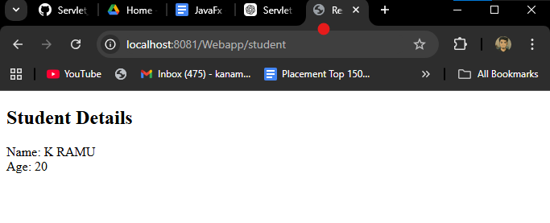
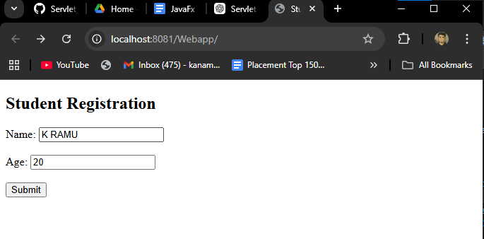

##  Mini Project on JSP+ Servlets
application : webapp
structure : 
```
Webapp
 ├── Java Resources
 │     └── src/main/java
 │           └── com.student
 │                 └── StudentServlet.java
 ├── src
 │     └── main
 │           └── webapp
 │                ├── index.jsp
 │                ├── result.jsp   
 │                └── WEB-INF
```

Output :



